# Rush 🦐

<p align="left">
  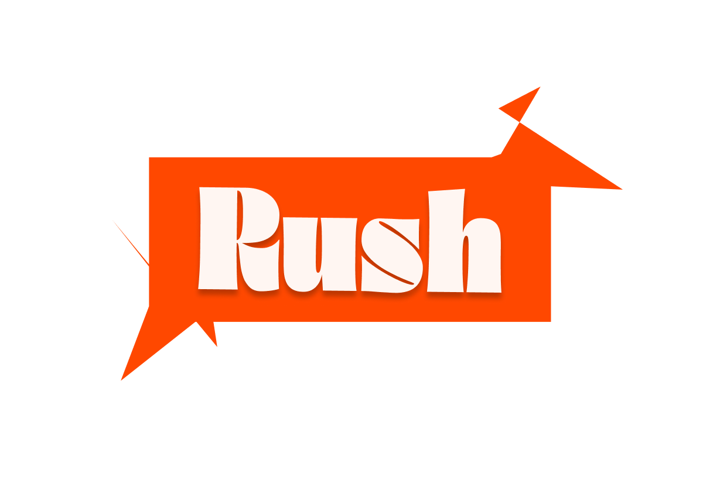
</p>

**Rush** — это учебный full-stack проект биржи фриланса.  
Офферы с разными статусами, авторизация/регистрация, личный кабинет пользователя, система откликов, админ-панель, рабочие чаты, фильтрация с поиском, архивация и удаление заявок.

> PHP + MySQL на backend, JavaScript на frontend и один большой CSS-файл со всем дизайном для Desktop/Tablet/Phone версий + макет Figma: [Биржа WANTED](https://www.figma.com/design/Sdu8S31kdtkDsFyMCfVV9y/%D0%91%D0%B8%D1%80%D0%B6%D0%B0-WANTED?node-id=227-749&t=sawvjfrpKxmCe7XT-1).

## Навигация

1. [О проекте](#о-проекте)
2. [Функциональность](#функциональность)
3. [Роли User и Admin](#роли-user-и-admin)
4. [Типы заявок и их статусы](#типы-заявок-и-их-статусы)
5. [Архитектура](#архитектура)
6. [База данных](#база-данных)
7. [Дизайн](#дизайн)
8. [Технологии](#технологии)
9. [Интересные детали](#интересные-детали)
10. [Структура проекта](#структура-проекта)
11. [Запуск проекта](#запуск-проекта)

## О проекте

Rush имитирует небольшую фриланс-биржу. В ней администратор создает заявки, а пользователи могут просматривать доступные предложения, откликаться на них и вести рабочий чат после одобрения отклика. 

Технически в нем:

- регистрация и вход;
- роли пользователей;
- сохранение сессии;
- загрузка аватаров;
- Библиотека TomSelect;
- Защищенные SQL запросы;
- фильтрация, сортировка и поиск заявок;
- система откликов;
- принятие и отклонение кандидатов;
- чат между заказчиком и исполнителем;
- отметки прочитанности сообщений;
- завершение работы;
- архивирование и восстановление заявок

## Функциональность

### Unsigned

#### Landing

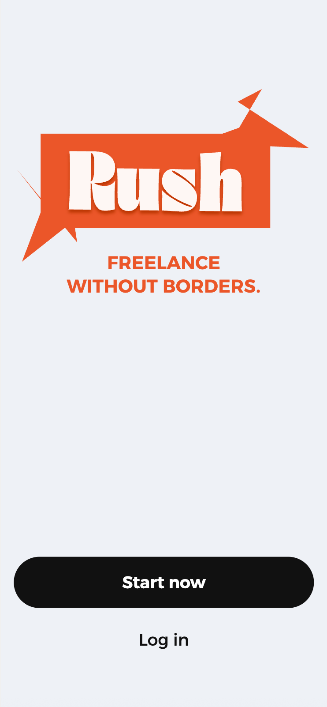

Неавторизованный пользователь видит landing с двумя кнопками - **Start now** (зарегистрироваться) и **Log in** (войти). 

#### Registration

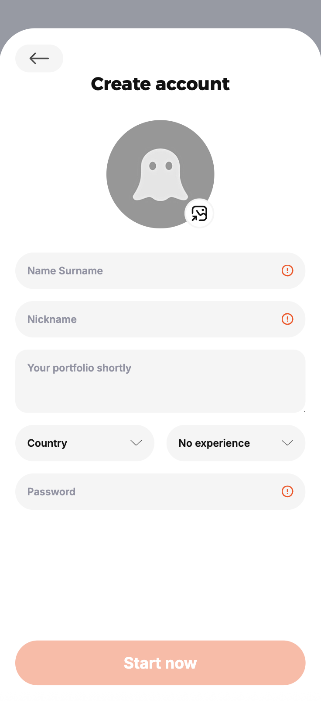

1. Валидация формы есть на HTML, JS, CSS и PHP:
   [HTML required-поля](index.php#L47-L87),
   [JS checkValidity()](script.js#L155-L170),
   [CSS для invalid required-полей](style.css#L299-L307),
   [PHP-проверка registration.php](registration.php#L82-L86).
2. Пароль сохраняется безопасно через `password_hash()`:
   [registration.php](registration.php#L100-L104).
3. Аватар проверяется по размеру и MIME-формату:
   [registration.php](registration.php#L37-L75).
4. Аккаунт создается в базе MySQL через prepared statement:
   [registration.php](registration.php#L102-L106).

#### Login

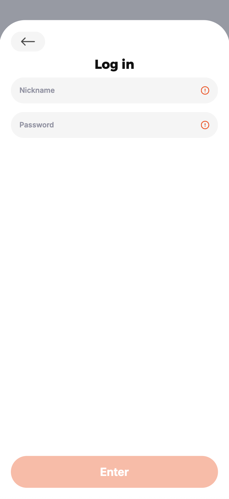

1. Пользователь ищется по nickname, а пароль проверяется через `password_verify()`:
   [login.php](login.php#L20-L30).
2. Валидация login-формы есть на уровне HTML, JS и PHP:
   [HTML required-поля](index.php#L95-L103),
   [JS checkValidity()](script.js#L155-L170),
   [PHP-проверка login.php](login.php#L11-L18).
3. Ошибка входа выводится безопасно через `htmlspecialchars()`:
   [index.php](index.php#L100-L102).

#### Guest offers

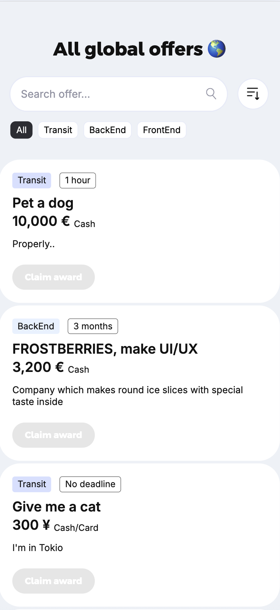

Ниже неавторизованный пользователь может увидеть все доступные офферы, но откликнуться не может.

### User

Пользователь после регистрации получает обычную роль `User`. Для него доступна основная биржа и личный кабинет. (а еще конфетти)

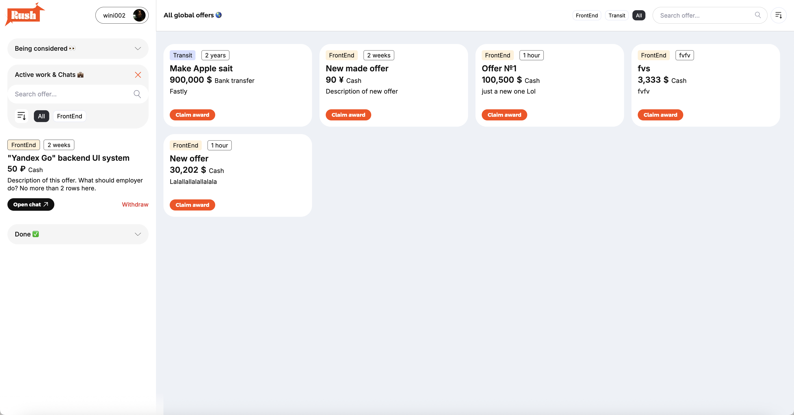

<p>
  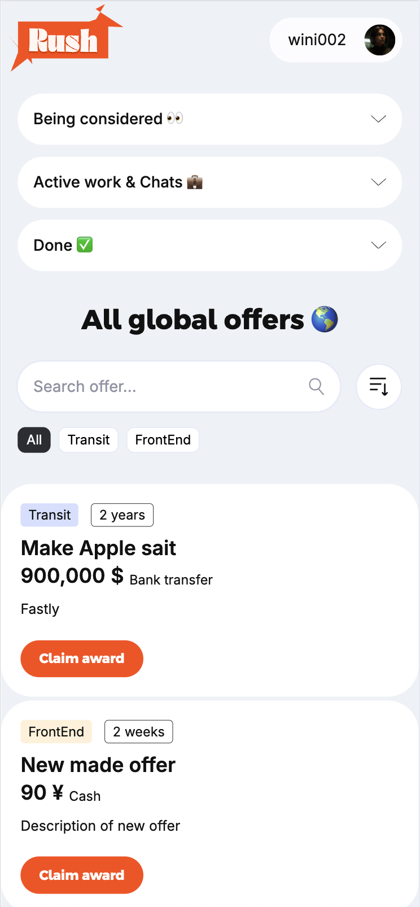
  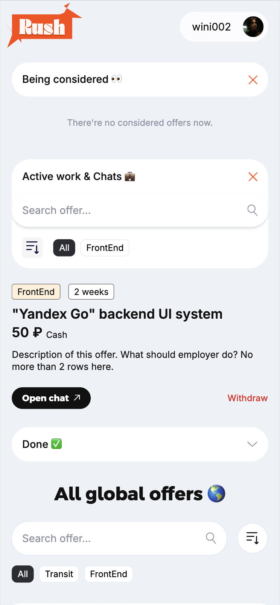
</p>

Возможности пользователя:

- создать аккаунт с именем, никнеймом, страной, опытом, описанием и аватаром;
- войти в аккаунт через никнейм и пароль;
- обновлять профиль в личном кабинете;
- смотреть список всех доступных заявок;
- искать заявки по тексту;
- фильтровать заявки по категориям;
- сортировать заявки по оплате;
- отправлять отклик на заявку;
- видеть заявки, которые находятся на рассмотрении;
- отозвать отклик, пока он еще не принят;
- видеть активные работы и открытые чаты;
- выйти из активной работы, если пользователь является исполнителем;
- смотреть завершенные работы;
- писать сообщения в рабочем чате.

### Admin

Админ-панель находится отдельно от обычного пользовательского интерфейса и доступна только пользователям с ролью `1`.

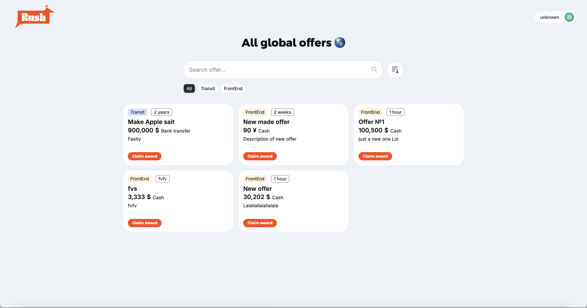

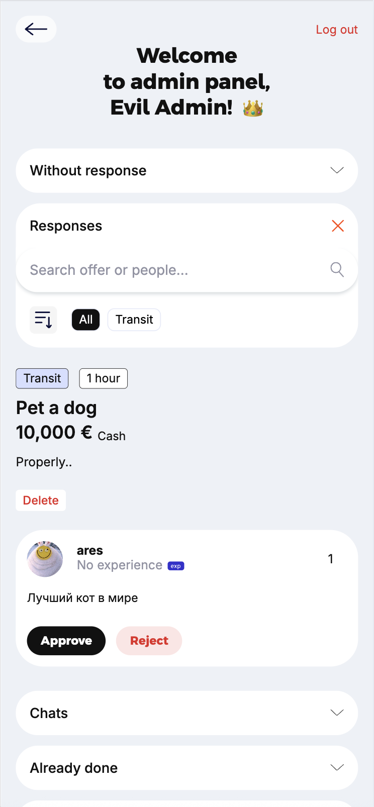

Возможности администратора:

- создавать новые заявки;
- выбирать существующую категорию или создавать новую;
- выбирать валюту;
- редактировать заявки, на которые еще нет откликов;
- удалять заявку в архив;
- просматривать заявки без откликов;
- просматривать все отклики пользователей;
- принимать или отклонять кандидатов;
- автоматически создавать чат после принятия кандидата;
- просматривать активные чаты;
- завершать работу;
- отклонять уже выбранного исполнителя и возвращать заявку обратно в доступные;
- просматривать завершенные заявки;
- переносить заявки в архив (30 дней, последующее удаление);
- восстанавливать заявку из архива;
- удалять архивную заявку полностью.

## Роли User и Admin

Роли хранятся в таблице `Users` в поле `role`.

| Роль | Значение | Что может делать |
| --- | ---: | --- |
| User | `0` | Смотреть заявки, откликаться, работать в чатах, редактировать профиль |
| Admin | `1` | Управлять заявками, откликами, чатами, завершением и архивом |

Проверка роли выполняется на backend-стороне через `$_SESSION['user_role']`. Даже если пользователь вручную откроет ссылку на админку, PHP проверит сессию и перенаправит его обратно.

Примеры защищенных мест:

- `account.php` не пускает админа в обычный личный кабинет и отправляет его в админ-панель;
- `nothing-to-watch-here/superSecret_adminRoom.php` доступен только admin;
- админские JSON endpoints проверяют `user_role === 1`;
- обычные chat endpoints проверяют, что пользователь является участником чата или админом.

## Типы заявок и их статусы

Главная сущность проекта — заявка из таблицы `Applications`. Ее состояние хранится в поле `status`.

| Status | Состояние | Значение в интерфейсе |
| ---: | --- | --- |
| `0` | Без откликов | Заявка доступна пользователям и находится в админском разделе `Without response` |
| `1` | Есть отклики | Заявка находится на рассмотрении в `Responses` |
| `2` | Исполнитель выбран | Создан чат, заявка перешла в активную работу |
| `3` | Завершена | Работа отмечена как выполненная |
| `9` | Архив | Заявка скрыта из активных списков и хранится в архиве.Удалится через 30 дней. |

Отдельно есть статусы откликов в таблице `requests`.

| Status | Состояние отклика |
| ---: | --- |
| `0` | Отклик ожидает решения админа |
| `1` | Отклик принят |
| `2` | Отклик отклонен |

### Жизненный цикл заявки
Для тех кому нужна структура:

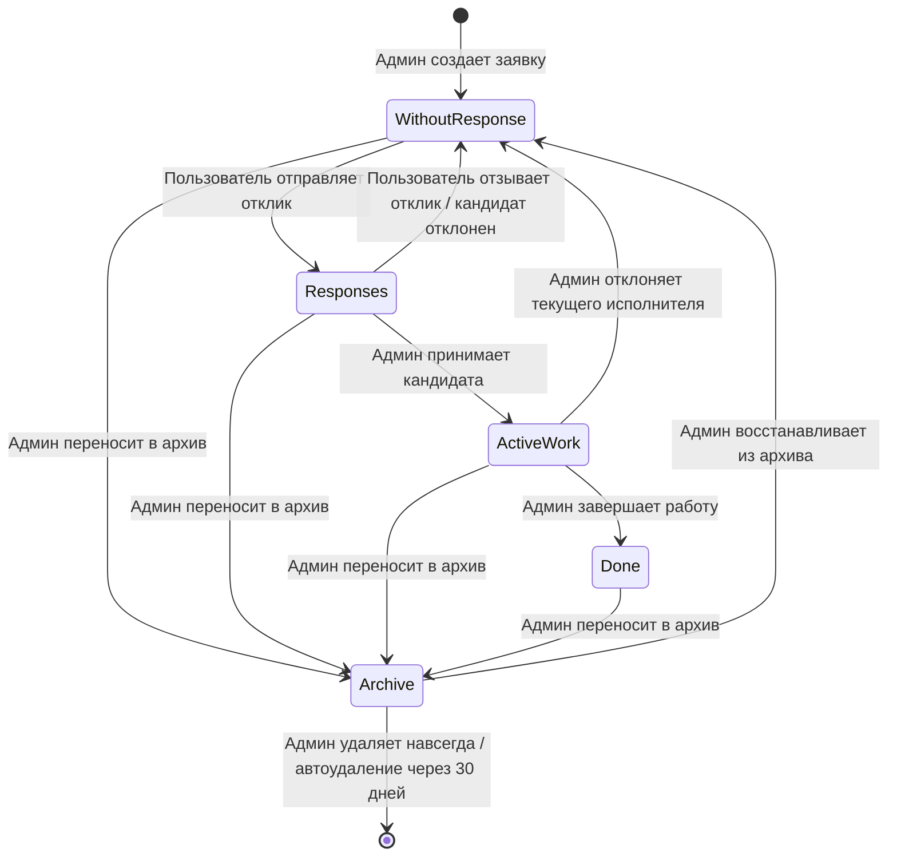

## Архитектура

Проект построен без frontend-фреймворков. PHP отдает HTML-страницы, а JavaScript догружает данные через `fetch` и обновляет интерфейс без полной перезагрузки страницы (AJAX).

### Общая схема

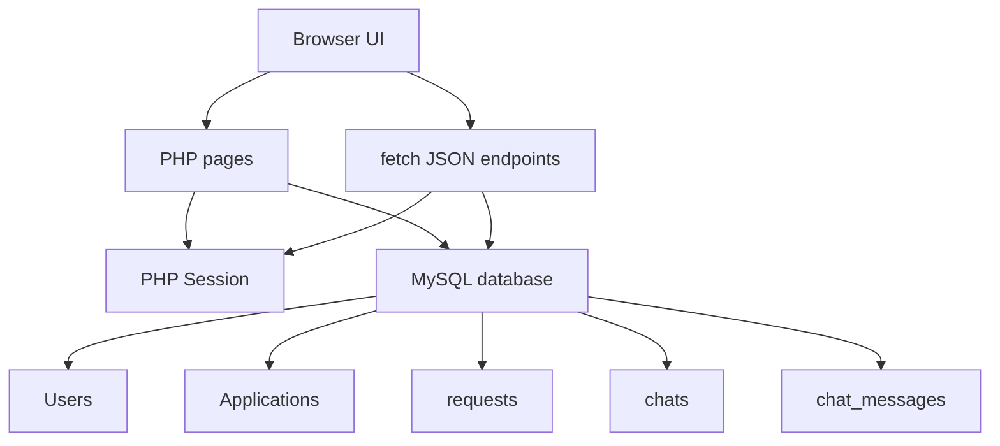

### Frontend

Frontend написан на обычном JavaScript без сборщика и frontend-фреймворков. Логика разделена по страницам и крупным частям интерфейса:

- [`script.js`](script.js) — открытие/закрытие auth-панелей, черновики форм регистрации/логина;
- [`viewing_offers.js`](viewing_offers.js) — пользовательская витрина заявок, поиск, фильтры, сортировка, отклики, пользовательские секции;
- [`account_script.js`](account_script.js) — личный кабинет, предпросмотр аватара и сохранение черновиков полей;
- [`nothing-to-watch-here/superSecretScript.js`](nothing-to-watch-here/superSecretScript.js) — админский список заявок без откликов, редактирование и фильтры;
- [`nothing-to-watch-here/make.js`](nothing-to-watch-here/make.js) — создание новой заявки, черновик формы и live-preview карточки;
- [`nothing-to-watch-here/suffering_response.js`](nothing-to-watch-here/suffering_response.js) — отображение откликов и принятие/отклонение кандидатов;
- [`nothing-to-watch-here/chats.js`](nothing-to-watch-here/chats.js) — список активных чатов в админке;
- [`nothing-to-watch-here/offers_done.js`](nothing-to-watch-here/offers_done.js) — завершенные заявки;
- [`nothing-to-watch-here/archive.js`](nothing-to-watch-here/archive.js) — архив, восстановление и окончательное удаление.

> Я его начинал 2 месяца назад. Сейчас логика разделена по отдельным файлам и страницам. В дальнейшем я буду использовать `routes`.

### Backend

Backend написан на PHP и использует `mysqli`.
>  **P.S.** Даа файлов очень много, сейчас изучаю `routes`

Основные backend-файлы:

| Файл | Назначение |
| --- | --- |
| `auth_bootstep.php` | Запуск PHP-сессии |
| `connect.php` | Подключение к MySQL и проверка существования пользователя из сессии |
| `registration.php` | Регистрация, хеширование пароля, загрузка аватара |
| `login.php` | Вход через `password_verify` |
| `logout.php` | Завершение сессии |
| `account_update.php` | Обновление профиля и аватара |
| `request.php` | Возвращает списки заявок для главной страницы |
| `scary_request_system.php` | Создает отклик пользователя на заявку |
| `considered_refuse.php` | Отзывает отклик пользователя |
| `withdraw_work.php` | Позволяет исполнителю выйти из активной работы |
| `nothing-to-watch-here/super_request.php` | Данные для админки: заявки без откликов, отклики, категории, валюты |
| `nothing-to-watch-here/make_offer.php` | Создание новой заявки |
| `nothing-to-watch-here/without_update.php` | Редактирование заявки без откликов |
| `nothing-to-watch-here/response_decision.php` | Принятие или отклонение отклика |
| `nothing-to-watch-here/chat_list.php` | Список активных чатов |
| `nothing-to-watch-here/chat_room.php` | Страница конкретного чата |
| `nothing-to-watch-here/chat_messages.php` | Получение новых сообщений и отметка прочитанности |
| `nothing-to-watch-here/chat_send.php` | Отправка сообщения |
| `nothing-to-watch-here/chat_application_action.php` | Завершение работы или отклонение исполнителя |
| `nothing-to-watch-here/done_list.php` | Список завершенных заявок |
| `nothing-to-watch-here/offer_delete.php` | Перенос заявки в архив |
| `nothing-to-watch-here/archive_list.php` | Список архива и автоочистка старых заявок |
| `nothing-to-watch-here/archive-republish.php` | Восстановление архивной заявки |
| `nothing-to-watch-here/archive_absolute_delete.php` | Полное удаление архивной заявки |

## База данных

В коде используются следующие таблицы:

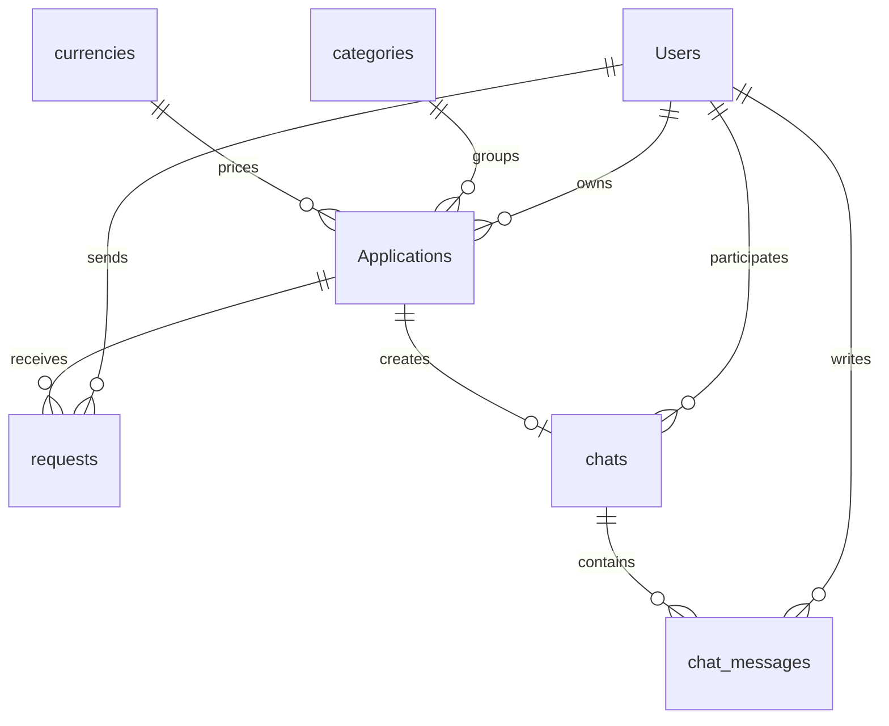

### Основные таблицы

`Users`

- `id`
- `name`
- `nickname`
- `avatar`
- `password_hash`
- `country`
- `role`
- `user_desc`
- `experience_months`

`Applications`

- `id`
- `title`
- `category_id`
- `deadline`
- `award`
- `currency_id`
- `award_desc`
- `description`
- `owner_id`
- `executor_id`
- `status`
- `archived_at`

`requests`

- `id`
- `application_id`
- `user_id`
- `message`
- `status`

`chats`

- `id`
- `application_id`
- `owner_id`
- `executor_id`
- `owner_last_read_message_id`
- `executor_last_read_message_id`
- `created_at`

`chat_messages`

- `id`
- `chat_id`
- `sender_id`
- `body`
- `created_at`

`categories`

- `id`
- `name`

`currencies`

- `id`
- `name`

## Дизайн

Интерфейс сделан вручную через `style.css`. В проекте используются кастомные шрифты из папки `fonts`: `Argentum Sans` и `Inter`.

Особенности дизайна:

- отдельный landing для неавторизованного пользователя;
- карточки заявок с категорией, дедлайном, описанием и оплатой;
- цветные category chips;
- разные секции для `Available`, `Being considered`, `Active work & Chats`, `Done`;
- адаптивная desktop-раскладка для пользователя после `900px`;
- отдельная desktop-версия админки;
- полноэкранная modal-панель создания заявки в админке;
- чат в виде отдельной сфокусированной страницы;
- кастомный input сообщения с автоизменением высоты;
- иконки статуса сообщения: прочитано / не прочитано;
- скрытие скроллбаров в некоторых desktop-зонах;
- использование современных CSS-селекторов вроде `:has()`.

## Технологии

| Технология | Где используется |
| --- | --- |
| `PHP` | Рендеринг страниц, API endpoints, сессии, работа с MySQL |
| `MySQL` | Хранение пользователей, заявок, откликов, чатов и сообщений |
| `mysqli` | SQL-запросы через prepared statements |
| `JavaScript` | Динамический интерфейс, fetch-запросы, фильтры, сортировка, чат |
| `CSS` | Полная ручная стилизация и адаптивная верстка |
| `localStorage` | Черновики форм, открытые секции, состояние панели создания |
| `Tom Select` | Улучшенные select-поля в админке |
| `ResizeObserver` | Подстройка отступа под высоту формы сообщения в чате |
| `FormData` | Отправка форм и действий без перезагрузки |
| `JSON` | Обмен данными между frontend и PHP endpoints |

## Интересные детали

### Идеи
- Уже ближе к концу Rush я придумал маскота. Это 🦐. Такой же фирменный цвет, странная, милая.
- После успешной регистрации и авторизации срабатывает конфетти 🎉
- Изначально проект назывался WANTED и имел черно-кислотные тона но я сменил на Rush потому что он легче произносится и запоминается. 
- Я делал его 2 месяца. Это мой первый масштабный учебный проект, по моим первым и последним backend коммитам можно увидеть сколько нового я узнал. 

### Авторизация и безопасность

- Пароли не хранятся в открытом виде: при регистрации используется `password_hash`.
- При входе пароль проверяется через `password_verify`.
- PHP-сессия хранит `user_id`, `user_role`, `nickname`, `name`, `avatar` и другие данные профиля.
- Backend проверяет права доступа перед каждым важным действием.
- SQL-запросы в основных местах выполняются через `prepare` и `bind_param`.
- Аватары проверяются по MIME-типу, а не только по расширению файла.
- Для файлов есть ограничение размера.
- Имена загруженных аватаров генерируются через `random_bytes`, чтобы избежать конфликтов.

### Отклики и защита от гонок

В `response_decision.php` используется транзакция MySQL и `FOR UPDATE`. Это важно, потому что два админских действия не должны одновременно принять разных исполнителей на одну и ту же заявку.

При принятии кандидата:

1. заявка получает `executor_id`;
2. `Applications.status` меняется на `2`;
3. создается запись в `chats`;
4. выбранный request получает `status = 1`;
5. остальные request этой заявки получают `status = 2`.

### Чат

Чат работает через периодический polling:

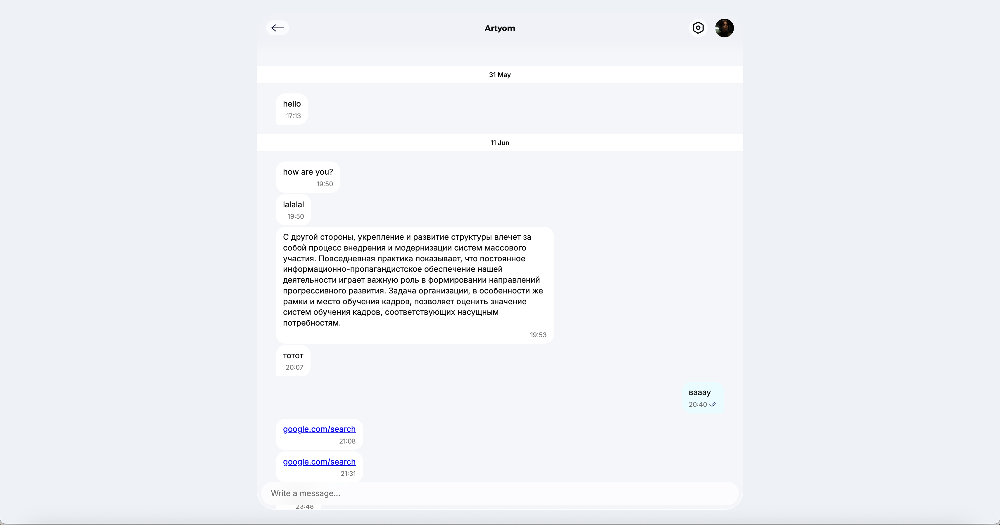

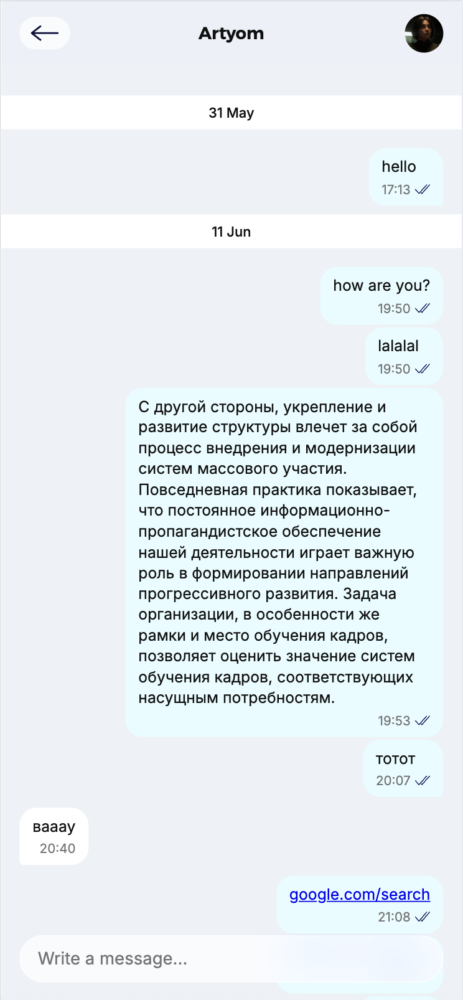

- frontend вызывает `chat_messages.php` каждые `2500ms`;
- endpoint возвращает только новые сообщения через `after_id`;
- сообщения группируются по датам;
- ссылки в тексте автоматически превращаются в кликабельные;
- черновик сообщения сохраняется в `localStorage`;
- если работа завершена, форма отправки скрывается;
- для своих сообщений показывается иконка прочитанности.

### Архив

Архив сделан не просто как скрытие карточки. При переносе заявки в архив:

- заявка получает `status = 9`;
- сохраняется `archived_at`;
- админ видит, сколько дней осталось до автоудаления;
- старые архивные заявки удаляются после 30 дней;
- перед удалением чистятся связанные `chat_messages`, `chats` и `requests`;
- заявку можно восстановить из архива обратно в `status = 0`.

### Черновики и состояние интерфейса

Проект активно использует `localStorage`, чтобы интерфейс не терял состояние:

- открытая auth-панель;
- черновики регистрации;
- черновики редактирования профиля;
- открытая секция заявок;
- открытая секция админки;
- черновик создания заявки;
- состояние панели создания заявки;
- черновик сообщения в чате.

## Структура проекта

```text
.
├── index.php                         # Главная страница и витрина заявок
├── account.php                       # Личный кабинет пользователя
├── registration.php                  # Регистрация
├── login.php                         # Авторизация
├── logout.php                        # Выход
├── account_update.php                # Обновление профиля
├── request.php                       # JSON-данные для главной страницы
├── scary_request_system.php          # Отклик на заявку
├── considered_refuse.php             # Отзыв отклика
├── withdraw_work.php                 # Выход из активной работы
├── connect.php                       # Подключение к базе данных
├── auth_bootstep.php                 # Запуск сессии
├── style.css                         # Основные стили проекта
├── script.js                         # Auth UI
├── viewing_offers.js                 # Логика пользовательской витрины
├── account_script.js                 # Личный кабинет
├── images/                           # Иконки и изображения интерфейса
├── readme_images/                    # Скриншоты для README
├── fonts/                            # Локальные шрифты
├── users_avatars/                    # Загруженные аватары пользователей
└── nothing-to-watch-here/
    ├── superSecret_adminRoom.php     # Админ-панель
    ├── superSecretScript.js          # Заявки без откликов
    ├── make.js                       # Создание новой заявки
    ├── suffering_response.js         # Отклики пользователей
    ├── chats.js                      # Активные чаты
    ├── offers_done.js                # Завершенные заявки
    ├── archive.js                    # Архив
    ├── chat_room.php                 # Комната чата
    ├── chat_messages.php             # Получение сообщений
    ├── chat_send.php                 # Отправка сообщений
    ├── response_decision.php         # Принять / отклонить кандидата
    ├── chat_application_action.php   # Завершить работу / отклонить исполнителя
    ├── make_offer.php                # Создать заявку
    ├── without_update.php            # Обновить заявку
    ├── offer_delete.php              # Архивировать заявку
    ├── archive_list.php              # Получить архив
    ├── archive-republish.php         # Восстановить из архива
    ├── archive_absolute_delete.php   # Удалить навсегда
    └── vendor/tom-select/            # Локальная копия Tom Select
```

## Запуск проекта

Проект рассчитан на локальный PHP + MySQL сервер, например MAMP или XAMPP.

1. Склонировать репозиторий.

```bash
git clone https://github.com/Wini0022/WANTED-freelance-Educational-project-.git
```

2. Положить проект в папку локального сервера.

Например для MAMP:

```text
Applications/MAMP/htdocs/
```

3. Создать базу данных.

В `connect.php` сейчас используются такие настройки:

```php
$db_host = '127.0.0.1';
$db_user = 'root';
$db_password = 'root';
$db_db = 'wanted';
$db_port = 8889;
```

Значит локальная база должна называться `wanted`.

4. Создать таблицы.

Структура базы описана в [`schema.sql`](schema.sql). Основные таблицы: `Users`, `Applications`, `categories`, `currencies`, `requests`, `chats`, `chat_messages`.

5. Открыть проект в браузере.

```text
http://localhost:8888/WANTED-freelance-Educational-project-/
```

Порт может отличаться в зависимости от настроек MAMP/XAMPP.

Проект завершен как учебная версия. Ура 🎉 
Последний проверенный коммит: `44460fc` — `THE END (Desktop Chat + Admin Desktop) 🦐`.
